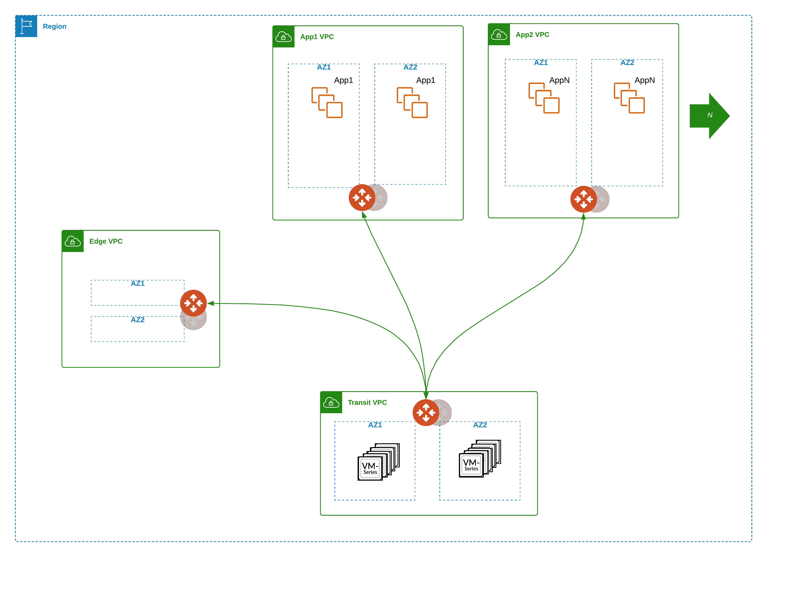

# Aviatrix Transit FireNet AWS (with custom AWS VPC)

### Summary

This repo builds Aviatrix Transit FireNet in AWS, custom AWS VPCs with Aviatrix spokes attached. 

### BOM

- 1 Aviatrix Transit FireNet in AWS with **_N_** custom VPCs containing Aviatrix spokes defined in terraform.tfvars, that will be attached to Aviatrix Transit Gateway.
- Custom VPC (2 public, 2 private subnets each set being in AZ1/AZ2)

### Infrastructure diagram



### Compatibility
Terraform version | Controller version | Terraform provider version
:--- | :--- | :---
0.13 | 6.3 | 2.18

### Modules

Module Name | Version | Description
:--- | :--- | :---
[terraform-aviatrix-modules/aws-transit-firenet/aviatrix](https://registry.terraform.io/modules/terraform-aviatrix-modules/aws-transit-firenet/aviatrix/latest) | 3.0.2 | This module deploys a VPC, Aviatrix transit gateways and firewall instances.
[terraform-aws-modules/vpc/aws](https://registry.terraform.io/modules/terraform-aws-modules/vpc/aws/latest) | 2.77.0 | Terraform module which creates VPC resources on AWS

### Variables

The variables are defined in ```terraform.tfvars```.

### Prerequisites

- Software version requirements met
- Aviatrix Controller with Access Account in AWS
- Sufficient limits in place for AWS region in scope **_(EIPs, Compute quotas, etc.)_**
- Subscription to NGFW vendor solution in AWS Marketplace
- terraform .13 in the user environment ```terraform -v``` **_or use hashicorp/terraform docker image_** Instructions below.
- AWS terraform requirements met

### Workflow

- Modify ```terraform.tfvars``` _(i.e. access account name, regions, cidrs, etc.)_ and save the file.
- ```terraform init```
- ```terraform plan```
- ```terraform apply --auto-approve```

### Deploy with hashicorp docker image

#### 1) Pull the 13.6 image
```
docker pull hashicorp/terraform:0.13.6
```
#### 2) Init in $PWD with environment variables set
```
docker run -i -t -v $PWD:$PWD -w $PWD \
--env TF_VAR_username=$TF_VAR_username \
--env TF_VAR_password=$TF_VAR_password \
--env TF_VAR_controller_ip=$TF_VAR_controller_ip \
hashicorp/terraform:0.13.6 init
```

#### 3) Plan in $PWD with environment variables set
```
docker run -i -t -v $PWD:$PWD -w $PWD \
--env TF_VAR_username=$TF_VAR_username \
--env TF_VAR_password=$TF_VAR_password \
--env TF_VAR_controller_ip=$TF_VAR_controller_ip \
hashicorp/terraform:0.13.6 plan
```

#### 4) Apply in $PWD with environment variables set
```
docker run -i -t -v $PWD:$PWD -w $PWD \
--env TF_VAR_username=$TF_VAR_username \
--env TF_VAR_password=$TF_VAR_password \
--env TF_VAR_controller_ip=$TF_VAR_controller_ip \
hashicorp/terraform:0.13.6 apply --auto-approve
```

### Terraform state (post-provisioning)

```
$ terraform state list
aviatrix_spoke_gateway.spoke_gateway["vpc1"]
aviatrix_spoke_gateway.spoke_gateway["vpc2"]
aviatrix_spoke_gateway.spoke_gateway["vpc3"]
aviatrix_spoke_transit_attachment.default["vpc1"]
aviatrix_spoke_transit_attachment.default["vpc2"]
aviatrix_spoke_transit_attachment.default["vpc3"]
module.transit_firenet.aviatrix_firenet.firenet
module.transit_firenet.aviatrix_firewall_instance.firewall_instance_1[0]
module.transit_firenet.aviatrix_firewall_instance.firewall_instance_2[0]
module.transit_firenet.aviatrix_firewall_instance_association.firenet_instance1[0]
module.transit_firenet.aviatrix_firewall_instance_association.firenet_instance2[0]
module.transit_firenet.aviatrix_transit_gateway.default
module.transit_firenet.aviatrix_vpc.default
module.vpc["vpc1"].aws_eip.nat[0]
module.vpc["vpc1"].aws_eip.nat[1]
module.vpc["vpc1"].aws_internet_gateway.this[0]
module.vpc["vpc1"].aws_nat_gateway.this[0]
module.vpc["vpc1"].aws_nat_gateway.this[1]
module.vpc["vpc1"].aws_route.private_nat_gateway[0]
module.vpc["vpc1"].aws_route.private_nat_gateway[1]
module.vpc["vpc1"].aws_route.public_internet_gateway[0]
module.vpc["vpc1"].aws_route_table.private[0]
module.vpc["vpc1"].aws_route_table.private[1]
module.vpc["vpc1"].aws_route_table.public[0]
module.vpc["vpc1"].aws_route_table_association.private[0]
module.vpc["vpc1"].aws_route_table_association.private[1]
module.vpc["vpc1"].aws_route_table_association.public[0]
module.vpc["vpc1"].aws_route_table_association.public[1]
module.vpc["vpc1"].aws_subnet.private[0]
module.vpc["vpc1"].aws_subnet.private[1]
module.vpc["vpc1"].aws_subnet.public[0]
module.vpc["vpc1"].aws_subnet.public[1]
module.vpc["vpc1"].aws_vpc.this[0]
module.vpc["vpc2"].aws_eip.nat[0]
module.vpc["vpc2"].aws_eip.nat[1]
module.vpc["vpc2"].aws_internet_gateway.this[0]
module.vpc["vpc2"].aws_nat_gateway.this[0]
module.vpc["vpc2"].aws_nat_gateway.this[1]
module.vpc["vpc2"].aws_route.private_nat_gateway[0]
module.vpc["vpc2"].aws_route.private_nat_gateway[1]
module.vpc["vpc2"].aws_route.public_internet_gateway[0]
module.vpc["vpc2"].aws_route_table.private[0]
module.vpc["vpc2"].aws_route_table.private[1]
module.vpc["vpc2"].aws_route_table.public[0]
module.vpc["vpc2"].aws_route_table_association.private[0]
module.vpc["vpc2"].aws_route_table_association.private[1]
module.vpc["vpc2"].aws_route_table_association.public[0]
module.vpc["vpc2"].aws_route_table_association.public[1]
module.vpc["vpc2"].aws_subnet.private[0]
module.vpc["vpc2"].aws_subnet.private[1]
module.vpc["vpc2"].aws_subnet.public[0]
module.vpc["vpc2"].aws_subnet.public[1]
module.vpc["vpc2"].aws_vpc.this[0]
module.vpc["vpc3"].aws_eip.nat[0]
module.vpc["vpc3"].aws_eip.nat[1]
module.vpc["vpc3"].aws_internet_gateway.this[0]
module.vpc["vpc3"].aws_nat_gateway.this[0]
module.vpc["vpc3"].aws_nat_gateway.this[1]
module.vpc["vpc3"].aws_route.private_nat_gateway[0]
module.vpc["vpc3"].aws_route.private_nat_gateway[1]
module.vpc["vpc3"].aws_route.public_internet_gateway[0]
module.vpc["vpc3"].aws_route_table.private[0]
module.vpc["vpc3"].aws_route_table.private[1]
module.vpc["vpc3"].aws_route_table.public[0]
module.vpc["vpc3"].aws_route_table_association.private[0]
module.vpc["vpc3"].aws_route_table_association.private[1]
module.vpc["vpc3"].aws_route_table_association.public[0]
module.vpc["vpc3"].aws_route_table_association.public[1]
module.vpc["vpc3"].aws_subnet.private[0]
module.vpc["vpc3"].aws_subnet.private[1]
module.vpc["vpc3"].aws_subnet.public[0]
module.vpc["vpc3"].aws_subnet.public[1]
module.vpc["vpc3"].aws_vpc.this[0]
```